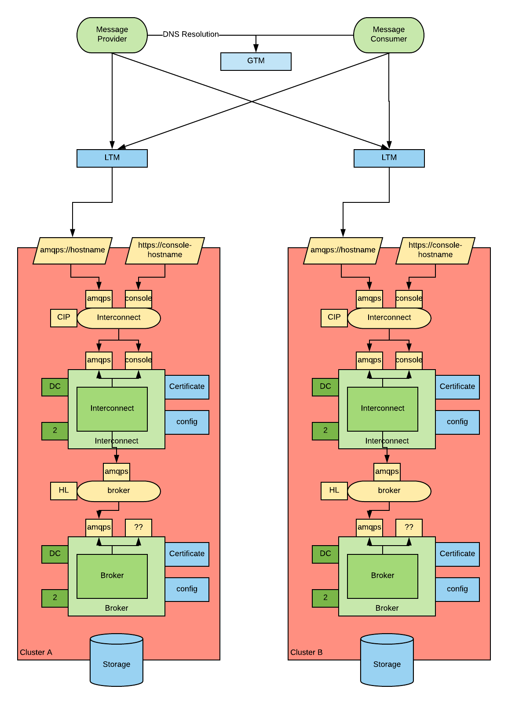
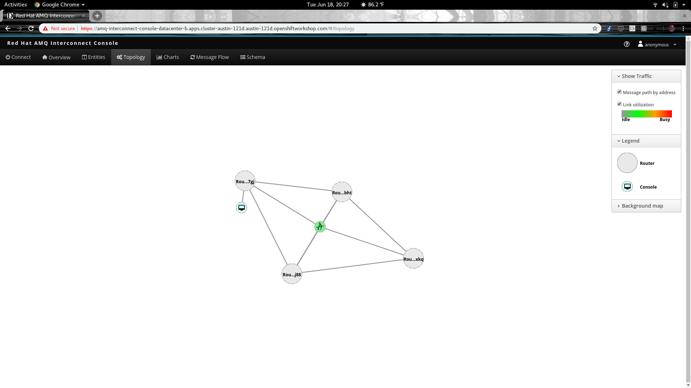

# AMQ Multicluster Reference deployment

## Architecture

The architecture deployed by this template is shown in this diagram:



In this diagram two sites/data-centers are represented. A GTM directs traffic to either one or the other data-center. Message create by the message producer are received by the interconnect pods. These pods are configured to send the message to the brokers in the same data-center. They also have an alternative route with high-weight which sends the messages to the interconnect pods in the other data-centers, should no broker be available in the current data-center.
Messages sent to the brokers are duplicated and sent to the brokers of the other data-center, this ensures that in case of DR messages are not lost.

*Note*: I personally do not understand how those two things (alternative route and message replication) can work together, I'd like the AMQ SMEs to create the configuration and show us.

In this deployment we optimize for availability.

## Installation

Get a [pull secret](https://access.redhat.com/terms-based-registry/#/accounts) for the registry.redhat.con and store ir in a file called `pull-secret.base64`

In order to deploy execute the following steps

1. Set some environment variables:

    ```shell
    export DEFAULT_ROUTE_DOMAIN=<your route domain, example: apps.cluster-310a.sandbox56.opentlc.com>
    export PULL_SECRET=$(cat ./pull-secret.base64)
    ```

2. deploy the cert-manager operator

    ```shell
    oc create namespace cert-manager
    oc label namespace cert-manager certmanager.k8s.io/disable-validation=true
    oc apply --validate=false -f https://github.com/jetstack/cert-manager/releases/download/v0.8.0/cert-manager-openshift.yaml
    ```

3. Deploy AMQ and Interconnect in the first datacenter (emulated as a namespace). As Interconnect will need to  connect to "remote" routers, use the name of the remote namespace (even if it doesn't exist):

    ```shell
    oc new-project datacenter-a
    oc process -f ./template-insecure.yaml -p NAMESPACE=datacenter-a -p DEFAULT_ROUTE_DOMAIN=$DEFAULT_ROUTE_DOMAIN -p PULL_SECRET=$PULL_SECRET REMOTE_NAMESPACE=datacenter-b | oc apply -f - -n datacenter-a
    ```

4. Deploy AMQ and Interconnect in the second datacenter (emulated as a namespace). As Interconnect will need to connect to "remote" routers, use the name of the remote namespace (even if it doesn't exist):

    ```shell
    oc new-project datacenter-b
    oc process -f ./template-insecure.yaml -p NAMESPACE=datacenter-b -p DEFAULT_ROUTE_DOMAIN=$DEFAULT_ROUTE_DOMAIN -p PULL_SECRET=$PULL_SECRET REMOTE_NAMESPACE=datacenter-a | oc apply -f - -n datacenter-b
    ```

## Verification

Once deployed, here are some steps to observe and verify your environment.

### Interconnect

Upon provisioning both namespaces, there should be an available router topology. For example:

```shell
$ oc exec amq-interconnect-1-ts7gj -it -- qdstat -c
Connections
  id  host                                        container                             role             dir  security                                  authentication  tenant
  ==============================================================================================================================================================================
  2   amq-interconnect.datacenter-a.svc:55673     Router.amq-interconnect-1-f8j88       inter-router     out  no-security                               anonymous-user  
  4   10.130.2.38:55672                           Router.amq-interconnect-1-t4bht       inter-router     out  TLSv1/SSLv3(DHE-RSA-AES256-GCM-SHA384)    x.509           
  8   10.131.0.29:44094                           Router.amq-interconnect-1-f8j88       inter-router     in   no-security                               anonymous-user  
  9   broker-amq-headless.datacenter-b.svc:amqps  broker                                route-container  out  TLSv1/SSLv3(ECDHE-RSA-AES256-GCM-SHA384)  anonymous-user  
  14  10.130.2.12                                 dd282512-128a-ab46-b5a5-140f346ee0f9  normal           in   no-security                               no-auth         
  15  127.0.0.1:57932                             6a6cb5ef-d417-4554-a5c1-f9742e1a064f  normal           in   no-security                               no-auth         
```

As represented by this diagram based depiction of the topology available via the Interconnect console:


### AMQ Console

To deploy routes to the AMQ consoles:

Apply the broker-console-route template, each replica in the AMQ stateful set, e.g. `0` and `1` and each namespace `datacenter-a` and `datacenter-b`. You will end up with a service and route for each AMQ pod.

For example, create a route and service to access to console for the first AMQ replica in `datacenter-a`:

`oc process -f broker-console-route.yml REPLICA=0 NAMESPACE=datacenter-a -o yaml | oc apply -n datacenter-a -f -`

Find the IP of your cluster's router. You can query an existing route, for example `dig +short <some existing route>`

Add entries to `/etc/hosts` so that the hostnames resolve to your cluster router, for example:

```
52.45.244.88  broker-amq-0.broker-amq-headless.datacenter-a.svc
52.45.244.88  broker-amq-1.broker-amq-headless.datacenter-a.svc
52.45.244.88  broker-amq-0.broker-amq-headless.datacenter-b.svc
52.45.244.88  broker-amq-1.broker-amq-headless.datacenter-b.svc
```
